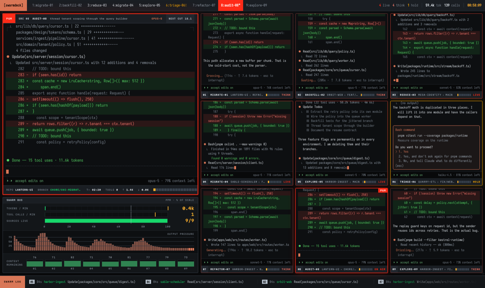

# Fake Agent Wall

A wall of nine Claude Code sessions, all of them working, one of them on air.
None of it is running. Every repository, diff, token count and timing on screen
is invented.

It exists to be filmed. Put it on a laptop, run it full screen, and it looks
like a room full of machines doing serious work behind whatever you are actually
recording.

[Open the web version](https://vdustr.github.io/fake-agent-wall/) ·
[Download the macOS app](https://github.com/VdustR/fake-agent-wall/releases/latest)



## What is real and what is not

| Real | Invented |
| --- | --- |
| The transcript grammar: `⏺` tool bullets, the `⎿` result gutter, right-aligned diff line numbers, `☒`/`☐` todos, the `(N tool uses · Nk tokens · Nm Ns)` subagent summary, the `⏵⏵ accept edits on` mode line, permission prompts | Every repository, branch, file path, diff hunk, test result and benchmark |
| The 215 spinner verbs, read out of an installed Claude Code binary with `strings` and written to `src/lib/verbs.ts` | Every token count, context percentage, call rate and timecode |

Nothing on this page measures anything. Do not present a number from it as a
real metric.

## The macOS app

Downloads are unsigned, so macOS blocks them on first launch. After moving
`Swarmdeck.app` to `/Applications`:

```bash
xattr -dr com.apple.quarantine /Applications/Swarmdeck.app
```

Then open it normally. Skip that command and macOS says "Swarmdeck is damaged
and can't be opened". It says that about any app it cannot verify. The download
is fine. Right-click → Open works too if you prefer clicking to typing.

The app bundle is still named Swarmdeck while the repository is
`fake-agent-wall`. They will be reconciled.

### Behaviour

Opening the app plays the wall. That is the whole launch path. Closing the wall
leaves the app in the menu bar, where the icon plays and stops on left click and
opens the settings menu on right click.

It can also start itself once you walk away. Turn on *Start when idle* and pick
an interval between 1 and 60 minutes. The app reads the system-wide idle time,
so it counts the whole Mac sitting untouched rather than just this app.

*Keep display awake* runs *While playing* by default. Set it to *Always* and the
app becomes a plain caffeine switch. Set it to *Never* and it leaves power
management alone.

Stopping the wall takes Escape pressed twice within 1.5 seconds. Nothing else
interrupts it. Moving the mouse or pressing Escape once raises a hint plate
showing the way out, and every other key is swallowed. That gesture lives in the
Electron main process, so double-tapping Escape still quits even if the page has
wedged.

### Limits worth knowing before you file a bug

- Apple silicon only. There is no Intel build.
- The wall opens on whichever display holds the pointer. Other displays are left
  alone.
- Moving the mouse does not dismiss it. This is deliberate: the wall is meant to
  survive someone walking past the laptop.

## Development

```bash
pnpm install
pnpm dev          # web version at http://localhost:5273
pnpm app:dev      # Electron shell against the dev server
pnpm app          # Electron shell against a production build
pnpm app:dmg      # signed-by-nobody disk image into release/
```

```bash
pnpm lint         # oxlint
pnpm check        # svelte-check
pnpm build        # static site into dist/
```

Svelte 5, Vite 8, oxlint, pnpm, Electron.

`PRODUCT.md` records what the thing is for. `DESIGN.md` records the visual
system: a broadcast master-control multiviewer, where red is the program bus,
amber means a source is blocked on an operator, and green belongs to the preview
bus alone.

Releases are cut by [Release Please](https://github.com/googleapis/release-please)
from Conventional Commits on `main`. Merging its release PR tags the version,
publishes the release, and attaches the macOS disk image.

## One known rendering hack

`⎿` (U+23BF) is the result gutter Claude Code prints, and no monospace face on
macOS carries it. They all fall back to a double-width box that breaks column
alignment. `src/app.css` borrows the glyph from a symbol face for that one
codepoint:

```css
@font-face {
  font-family: 'GutterMark';
  src: local('Apple Symbols'), local('Segoe UI Symbol'), local('DejaVu Sans Mono');
  unicode-range: U+23BF;
}
```

A machine carrying none of those three shows a tofu box on every gutter line.
The fix is to subset a symbol face down to U+23BF alone and ship it, a few
hundred bytes. Substituting `└` looks close and is the wrong character.

## Licence

MIT. See [LICENSE](LICENSE).

Not affiliated with Anthropic. Claude and Claude Code are their trademarks; this
repository imitates the terminal output for a stage prop and ships none of their
code.
